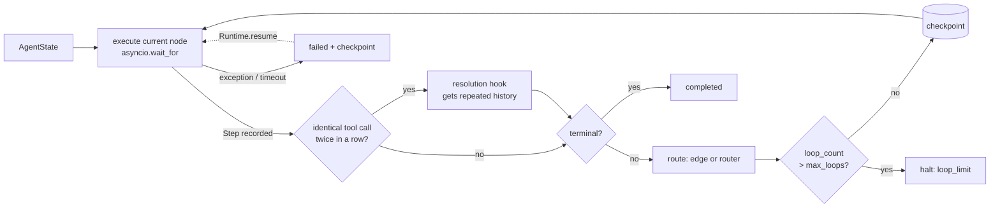

# agent-runtime — a durable, checkpointed state-machine executor for LLM agents

[](https://github.com/darrshangovender/agent-runtime/actions/workflows/tests.yml)
[](LICENSE)
[](https://python.org)
[](agent_runtime/checkpoint.py)

> The engine underneath an agent, not the agent. You describe the agent as a typed graph of async nodes; the runtime drives the transitions, enforces loop and time limits, persists the full `AgentState` after every node, and resumes a crashed run from its last checkpoint without re-executing the nodes that already finished. Model calls go through a fallback chain that ends in a rule-based tier which never raises, and structured output is validated against Pydantic with self-correcting re-prompts before it is allowed to degrade.

**Why this exists.** Agent loops fail in the same three ways every time: they loop forever because the model keeps making the same tool call, they lose everything when the process dies twenty steps in, and they carry on after the model returns JSON that does not match the schema because nobody checked. Frameworks tend to treat these as edge cases; here they are the design centre. Sibling repos: [multi-agent-orchestrator](https://github.com/darrshangovender/multi-agent-orchestrator) (role-based agents and handoffs) and [guardrail](https://github.com/darrshangovender/guardrail) (input/output safety) sit on top of a runtime like this one.

---

## Quick start

```bash
pip install -e ".[dev]"
python examples/research_agent.py     # loop-breaking fires, run completes
python examples/resume_demo.py        # crashes at node 3, resumes from SQLite
```

```python
from agent_runtime import AgentState, Graph, Output, Runtime, SQLiteCheckpointer, tool

@tool(timeout_s=5.0)
async def search(query: str) -> dict:
    return {"hits": [f"result for {query}"]}

async def plan(state):    return state
async def gather(state):  await search.run_step(state, query=state.input); return state
async def answer(state):  state.final = Output(content="done"); return state

graph = (Graph("demo")
    .add_node("plan", plan).add_node("gather", gather).add_node("answer", answer)
    .add_edge("plan", "gather")
    .add_conditional_edge("gather", lambda s: "answer" if s.tool_steps() else "gather",
                          targets=["answer", "gather"])   # declared targets → the gather loop is flagged
    .set_entry("plan").set_terminal("answer").build())

runtime = Runtime(checkpointer=SQLiteCheckpointer("checkpoints.db"))
final = await runtime.run(graph, AgentState(tenant_id="acme", input="durable agents"))
# later, in another process:  await Runtime(graph=graph, checkpointer=cp).resume(final.run_id)
```

## How it works



1. `Runtime.run(graph, state)` validates the graph (unreachable nodes, missing terminal, dead ends are build errors; cycles through static edges and declared router `targets` are allowed but emit `CycleWarning`) and checkpoints the initial state.
2. Each node runs under `asyncio.timeout` with its own or the runtime's default timeout, then a node-level `Step` is appended to `state.scratchpad`. A `TimeoutError` the node raises itself (for example a `ToolTimeoutError` from a tool with a shorter budget) is recorded as a `node_error`, not as the node's own timeout.
3. `find_consecutive_repeat` compares the last two tool steps; an identical `(tool, input)` pair hands `(state, history)` to the resolution hook, which can finalise or redirect. Without a hook the run halts.
4. Re-entering an already-completed node increments `loop_count`; past `max_loops` the run halts with a `loop_limit` error rather than spinning.
5. After routing, the state is saved as one row keyed `(run_id, seq)`; `seq` is the scratchpad length, so replays overwrite instead of duplicating.
6. `Runtime.resume(run_id)` loads the latest row, clears the error, and restarts at `current_node`. Nodes with an `ok` step already in the scratchpad are not re-executed; if the failure was a `routing` error (the node had finished, the router failed), resume routes from that node instead of running it again.

## Failure modes it handles

| Failure | Mechanism | Where |
|---|---|---|
| Infinite loop through the graph | `loop_count` vs `max_loops`, halts with `loop_limit` | `runtime.py` |
| Same tool called with the same input twice in a row | consecutive-repeat detection → resolution hook (or halt) | `runtime.py` |
| Node hangs | per-node `asyncio.timeout`, step marked `timeout` | `runtime.py`, `graph.py` |
| Process dies mid-run | checkpoint after every node; `resume()` skips completed nodes | `checkpoint.py`, `runtime.py` |
| Provider error or timeout | `FallbackChain` tries the next tier; tier index recorded on the response | `models.py` |
| Every provider down | `DeterministicFallback` tail never raises | `models.py` |
| Model returns invalid JSON / wrong shape | `enforce_schema` re-prompts with the validation error, then returns `DegradedResult` | `structured.py` |
| Tool called with bad arguments or by the wrong tenant | Pydantic input/output models, per-tool timeout, tenant allow-list | `tools.py` |
| Tool result leaks another tenant's rows | `tenant_filter` raises unless every record carries the caller's `tenant_id` | `guards.py` |
| Prompt injection via pasted text | `sanitize_input` strips control/zero-width chars and wraps in `<user_input>` | `guards.py` |

## Design decisions

| Decision | Why |
|---|---|
| **State is one strict Pydantic document** | `extra="forbid"`, `strict=True`; the whole run is a JSON string, so a checkpoint is a copy, not a reconstruction. |
| **Checkpoint sequence = scratchpad length** | Makes `save()` idempotent under replay without a separate version column. |
| **Nodes are `async (state) -> state`** | No DSL. A node is a function you can unit test and set a breakpoint in. |
| **Loop detection lives in the runtime, not the prompt** | Telling the model "don't repeat yourself" is not a control; comparing the last two tool inputs is. |
| **Fallback chain ends in a rule-based tier** | A chain that can raise is not a fallback. The last tier is checked to never raise. |
| **Schema failures degrade instead of raise** | `DegradedResult` carries the partial JSON and every attempt's error, so the caller decides, not the exception. |
| **Tracer via `ContextVar`** | Tools and model clients pick up the active tracer without threading it through every signature. |
| **OpenTelemetry is optional** | Imported lazily; missing package means JSON-lines only, no import error. |

## Limitations

- **Resume re-runs the node that was in flight.** A node that had side effects (sent an email, charged a card) before it raised will perform them again on resume. Only *completed* nodes are skipped; there is no per-node idempotency key.
- **Checkpoints are whole-state snapshots.** Every save writes the entire scratchpad, so a run with thousands of steps writes O(steps) bytes per node. Nothing prunes or compacts.
- **Node functions are not serialised.** Resume needs the same `Graph` object passed in; the checkpoint stores only the node *name*.
- **Repeat detection is exact-match only.** `(tool, input)` must be identical; a model that varies a query by one character is not caught, and only the last two tool steps are compared.
- **Timeouts cancel the coroutine but not the work.** `asyncio.timeout` cancels a node's task; a sync tool or a subprocess it started keeps running. Sync tool functions get no timeout at all.
- **Cycles through untyped routers are not flagged.** A conditional edge without `targets` may route anywhere, so it is treated as reaching every node for the reachability check but is not expanded for cycle detection (a warning naming an edge that may not exist would be worse than none). Declare `targets` to have the loop reported.
- **Tools register globally by default.** `@tool` adds to `default_registry`; defining the same tool name twice in one process (re-running a notebook cell) raises `ValueError`. Pass `registry=ToolRegistry()` or `registry=None` for throwaway tools.
- **`SQLiteCheckpointer` is single-process.** One connection, one lock, `to_thread` for I/O. Two runtimes writing the same `run_id` is undefined.
- **Cost is whatever the client reports.** `MockModel` and `DeterministicFallback` report the numbers they are constructed with; there is no provider price table, and no real provider client ships in this repo — the `anthropic`/`openai` extras only install SDKs.
- **`DeterministicFallback` is rules, not reasoning.** Its answers are canned; a chain that reaches it has produced a placeholder, and the `tier` on the response is how you tell.
- **Tenant allow-lists are advisory inside a process.** A node can call any `Tool` object it holds a reference to; the registry filter only governs lookups by name.

## Project layout

```
agent-runtime/
├── agent_runtime/
│   ├── state.py        # AgentState · Step · Output · RunError (strict Pydantic v2)
│   ├── graph.py        # Graph builder, validation, cycle flagging, routing
│   ├── runtime.py      # Runtime.run / resume · loop & repeat detection · timeouts
│   ├── checkpoint.py   # Checkpointer ABC · MemoryCheckpointer · SQLiteCheckpointer (WAL)
│   ├── models.py       # ModelClient · FallbackChain · DeterministicFallback · MockModel
│   ├── structured.py   # enforce_schema with self-correction → DegradedResult
│   ├── tools.py        # @tool · Tool · ToolRegistry · tenant allow-list · run_step
│   ├── telemetry.py    # Tracer (JSON lines) · OpenTelemetryTracer (lazy, no-op if absent)
│   └── guards.py       # sanitize_input · tenant_filter
├── examples/           # research_agent.py (loop-breaking) · resume_demo.py (crash + resume)
├── tests/              # offline, no API keys
├── Dockerfile · docker-compose.yml · Makefile
```

## Tests

```bash
pytest tests/ -q         # 111 tests, all offline
ruff check .
```

Covered: graph validation errors and cycle flagging; loop limit; identical-call detection with and without a hook; per-node and default timeouts; checkpoint round-trip, idempotent replay and WAL on SQLite; resume without re-execution; schema self-correction succeeding on the second retry and degrading after exhaustion; fallback tier recording on exception and timeout; the deterministic tier never raising; tenant allow-lists and `tenant_filter`; sanitiser stripping control characters and neutralising embedded delimiters; the OpenTelemetry adapter with and without the package; and both examples run end to end.

## Author

Darrshan Govender · [Agulhas Code](https://agulhascode.co.za) · Durban, South Africa
